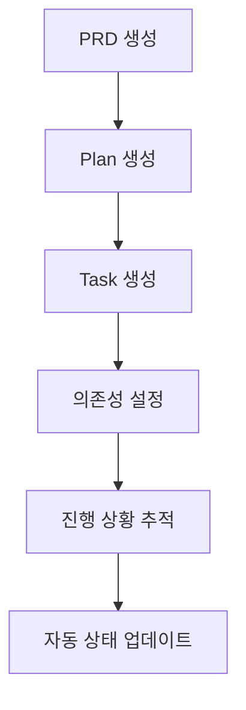

# 🚀 WorkflowMCP - Complete Product Development Lifecycle Management

완전한 제품 개발 라이프사이클을 관리하는 고급 MCP (Model Context Protocol) 서버입니다.

[](https://github.com/foswmine/workflow-mcp)
[](https://opensource.org/licenses/MIT)
[](https://nodejs.org)

## 🎯 **Phase 2 완성 - 26개 MCP 도구 제공**

### ✅ **Phase 1: 기본 CRUD (15개 도구)**
- **PRD 관리**: `create_prd`, `list_prds`, `get_prd`, `update_prd`
- **Task 관리**: `create_task`, `list_tasks`, `get_task`, `update_task`
- **Plan 관리**: `create_plan`, `list_plans`, `get_plan`, `update_plan`
- **유틸리티**: `get_metrics`, `validate_prd`, `export_data`

### ✅ **Phase 2: 고급 기능 (11개 도구)**

#### 🗑️ **안전한 삭제 (3개)**
- `delete_prd`: 의존성 체크 후 PRD 삭제
- `delete_task`: 의존성 체크 후 Task 삭제  
- `delete_plan`: 의존성 체크 후 Plan 삭제

#### 🔗 **데이터 연결 (5개)**
- `link_prd_to_plan`: PRD와 Plan 연결
- `link_plan_to_tasks`: Plan과 Task들 연결
- `get_linked_data`: 연결된 데이터 조회
- `unlink_items`: 연결 해제
- `sync_plan_progress`: Plan 진행률 자동 동기화

#### ⚡ **의존성 관리 (5개)**
- `add_task_dependency`: Task 의존성 추가 (순환 의존성 체크)
- `remove_task_dependency`: Task 의존성 제거
- `get_task_dependencies`: Task 의존성 조회
- `validate_workflow`: 워크플로 유효성 검사
- `auto_update_task_status`: 의존성 기반 자동 상태 업데이트

#### 📊 **기본 대시보드 (3개)**
- `get_project_dashboard`: 종합 프로젝트 대시보드
- `get_workflow_status`: 워크플로 상태 및 차단 요소 분석
- `get_progress_timeline`: 진행 타임라인 및 마감일 관리

## 🛠️ **기술적 특징**

### 🔄 **멀티 세션 지원**
- 여러 Claude Code 세션에서 동시 안전 사용
- FileStorage 기반 트랜잭션 안전성
- 순환 의존성 탐지 및 차단

### 🧠 **지능형 워크플로**
- DFS 알고리즘 기반 순환 의존성 탐지
- 의존성 완료에 따른 자동 상태 전환
- 실시간 차단 요소 분석 및 해결 방안 제시

### 📈 **실시간 분석**
- 프로젝트 진행률 실시간 계산
- 병목 지점 자동 감지
- 다가오는 마감일 추적 및 알림

## 🚀 **빠른 시작**

### 1. 설치
```bash
git clone https://github.com/foswmine/workflow-mcp.git
cd workflow-mcp
npm install
```

### 2. MCP 서버 등록
Claude Code의 `.mcp.json` 파일에 추가:

```json
{
  "mcpServers": {
    "workflow-mcp": {
      "command": "node",
      "args": ["./src/test-server.js"],
      "type": "stdio"
    }
  }
}
```

### 3. 서버 실행
```bash
npm start
# 또는 개발 모드
npm run dev
```

### 4. Claude Code에서 사용
```bash
# 새 Claude Code 세션에서
/mcp  # 연결 확인

# 기본 사용
create_prd로 첫 PRD를 생성해주세요.
get_project_dashboard로 현재 상황을 확인해주세요.
```

## 📖 **사용 가이드**

### 기본 워크플로


### 실제 사용 예시

#### 1. 프로젝트 시작
```javascript
// 1. PRD 생성
create_prd({
  "title": "사용자 인증 시스템",
  "description": "JWT 기반 인증 시스템 개발", 
  "requirements": ["로그인", "회원가입", "권한 관리"],
  "priority": "High"
})

// 2. Plan 생성 및 연결
create_plan({
  "title": "인증 시스템 개발 계획",
  "milestones": [
    {"title": "백엔드 API", "dueDate": "2025-10-15"},
    {"title": "프론트엔드 UI", "dueDate": "2025-10-30"}
  ]
})

link_prd_to_plan({ prd_id: "prd_xxx", plan_id: "plan_xxx" })
```

#### 2. Task 관리 및 의존성 설정
```javascript
// Task 생성
create_task({
  "title": "JWT 미들웨어 구현",
  "priority": "High",
  "estimatedHours": 8
})

// 의존성 설정 
add_task_dependency({
  "dependent_task_id": "task_frontend",
  "prerequisite_task_id": "task_backend"
})

// 자동 상태 업데이트
auto_update_task_status()
```

#### 3. 실시간 모니터링
```javascript
// 종합 대시보드
get_project_dashboard({ include_details: true })

// 워크플로 상태 분석
get_workflow_status({ analyze_blockers: true })

// 진행 타임라인
get_progress_timeline({ time_period: "30days" })
```

## 📊 **데이터 모델**

### PRD (Product Requirements Document)
```typescript
interface PRD {
  id: string;              // prd_timestamp
  title: string;
  description: string;
  requirements: string[];
  priority: 'High' | 'Medium' | 'Low';
  status: 'draft' | 'review' | 'approved' | 'archived';
  linked_plans: string[];  // Phase 2: 연결된 Plan IDs
  createdAt: string;
  updatedAt: string;
}
```

### Task (with Dependencies)
```typescript
interface Task {
  id: string;              // task_timestamp  
  title: string;
  description: string;
  status: 'todo' | 'in_progress' | 'done' | 'blocked';
  priority: 'High' | 'Medium' | 'Low';
  assignee?: string;
  estimatedHours?: number;
  dueDate?: string;
  dependencies: string[];   // Phase 2: 의존하는 Task IDs
  dependents: string[];     // Phase 2: 이 Task에 의존하는 IDs
  plan_id?: string;         // Phase 2: 연결된 Plan ID
  createdAt: string;
  updatedAt: string;
}
```

### Plan (with Progress Tracking)
```typescript
interface Plan {
  id: string;              // plan_timestamp
  title: string;
  description: string;
  prd_id?: string;         // Phase 2: 연결된 PRD ID
  status: 'active' | 'completed' | 'paused' | 'cancelled';
  milestones: Milestone[];
  linked_tasks: string[];  // Phase 2: 연결된 Task IDs
  progress: number;        // Phase 2: 0-100 자동 계산 진행률
  startDate?: string;
  endDate?: string;
  createdAt: string;
  updatedAt: string;
}
```

## 🧪 **테스트**

### Phase 2 종합 테스트
```bash
# 새 Claude Code 세션에서 실행
claude

# 테스트 가이드 문서 참조
docs/PHASE_2_COMPREHENSIVE_TEST_GUIDE.md
```

### 수동 테스트
```bash
# 서버 시작 테스트
node src/test-server.js

# 기대 결과:
# ✅ FileStorage initialized for prds
# ✅ FileStorage initialized for tasks  
# ✅ FileStorage initialized for plans
# ✅ WorkflowMCP Phase 2 Complete - CRUD + Deletion + Data Linking + Dependency Management + Dashboard system ready
```

## 📁 **프로젝트 구조**

```
workflow-mcp/
├── src/
│   ├── test-server.js        # 🎯 Phase 2 완성 MCP 서버 (3,129라인)
│   ├── index.js             # Legacy Phase 1 서버
│   ├── models/
│   │   └── PRDManager.js    # PRD 관리 클래스
│   └── utils/
│       └── FileStorage.js   # JSON 파일 저장소 (트랜잭션 안전)
├── data/                    # 자동 생성 데이터 폴더
│   ├── prds/               # PRD JSON 파일들 + index.json
│   ├── tasks/              # Task JSON 파일들 (의존성 포함)
│   └── plans/              # Plan JSON 파일들 (연결정보 포함)
├── docs/                   # 📚 상세 문서
│   ├── PHASE_1_COMPLETION_SUMMARY.md
│   ├── PHASE_2_COMPLETION_SUMMARY.md
│   ├── PHASE_2_COMPREHENSIVE_TEST_GUIDE.md
│   └── DEVELOPMENT_PROGRESS.md
├── schemas/
│   └── prd-schema.js       # PRD 검증 스키마
└── tests/                  # 테스트 파일들
```

## 🔮 **Phase 3 계획 (향후)**

### 🌐 **웹 대시보드 (Phase 2.6)**
- Express 기반 웹 서버
- 실시간 차트 및 시각화
- 칸반 보드 (Task 드래그&드롭)
- 간트 차트 (Plan 타임라인)
- SQLite 데이터베이스 직접 관리 UI

### 🗃️ **SQLite 전환 (Phase 2.5)**
- 멀티 Claude Code 세션 완전 지원
- 고성능 인덱싱 및 쿼리
- 자동 마이그레이션 (JSON → SQLite)
- 트랜잭션 안전성 완전 보장

## 🤝 **기여하기**

1. Fork this repository
2. Create your feature branch: `git checkout -b feature/amazing-feature`
3. Commit your changes: `git commit -m 'Add amazing feature'`
4. Push to the branch: `git push origin feature/amazing-feature`
5. Open a Pull Request

## 📝 **라이선스**

MIT License - [LICENSE](LICENSE) 파일을 참조하세요.

## 🙋‍♂️ **지원**

- **Issues**: [GitHub Issues](https://github.com/foswmine/workflow-mcp/issues)
- **문서**: `docs/` 폴더의 상세 가이드들
- **테스트**: `docs/PHASE_2_COMPREHENSIVE_TEST_GUIDE.md`

---

## 🏆 **성과 요약**

**WorkflowMCP v2.0**은 개인 생산성 도구에서 **완전한 엔터프라이즈급 프로젝트 관리 플랫폼**으로 발전했습니다:

- ✅ **26개 완전 기능 MCP 도구**
- ✅ **4개 고급 시스템** (삭제, 연결, 의존성, 대시보드)  
- ✅ **순환 의존성 방지** (DFS 알고리즘)
- ✅ **실시간 워크플로 자동화**
- ✅ **멀티 세션 안전성**

**이제 완전한 제품 개발 라이프사이클 관리가 가능합니다!** 🎉

---

**Made with ❤️ by foswmine using Claude Code**