# 🚀 WorkflowMCP - AI-Integrated Project Management Platform

완전한 소프트웨어 개발 생명주기(SDLC)를 관리하는 AI 통합 프로젝트 관리 플랫폼입니다.

[](https://github.com/foswmine/workflow-mcp)
[](https://opensource.org/licenses/MIT)
[](https://nodejs.org)
[](https://claude.ai/code)

> 📚 **[완전 사용자 가이드 보기](docs/USER_GUIDE.md)** - 모든 메뉴와 기능의 상세 사용법

## 🎯 **Phase 2.8 완성 - AI 기반 전체 라이프사이클 관리 플랫폼**

### ✅ **핵심 시스템 구성**

| 시스템 | 상태 | 설명 |
|--------|------|------|
| **🗄️ MCP 서버** | ✅ 완성 | 35개 AI 통합 관리 도구 + 완전한 CRUD |
| **🌐 웹 대시보드** | ✅ 완성 | SvelteKit 기반 실시간 UI + 연결 관리 |
| **📊 시각화** | ✅ 완성 | Chart.js + D3.js + 네트워크 시각화 |
| **📝 문서 관리** | ✅ 완성 | SQLite FTS 기반 통합 검색 시스템 |
| **🔗 연결 관리** | ✅ 신규 | 완전한 엔티티 간 연결 관리 시스템 |
| **🧪 테스트 관리** | ✅ 신규 | 테스트 케이스 생성 및 실행 관리 |

### 🛠️ **완전한 MCP 도구 세트 (35개)**

#### **📊 프로젝트 관리 (6개)**
```javascript
create_project()      // 프로젝트 생성
list_projects()       // 프로젝트 목록 조회
get_project()         // 프로젝트 상세 조회
update_project()      // 프로젝트 업데이트
delete_project()      // 프로젝트 삭제
get_project_analytics() // 프로젝트 분석
```

#### **📋 PRD 관리 (5개)**
```javascript
create_prd()          // PRD 생성
list_prds()           // PRD 목록 조회
get_prd()             // PRD 상세 조회
update_prd()          // PRD 업데이트
delete_prd()          // PRD 삭제
```

#### **🎨 설계 관리 (5개)**
```javascript
create_design()       // 설계 생성
list_designs()        // 설계 목록 조회
get_design()          // 설계 상세 조회
update_design()       // 설계 업데이트
delete_design()       // 설계 삭제
```

#### **📋 작업 관리 (7개)**
```javascript
create_task()         // 작업 생성
list_tasks()          // 작업 목록 조회
get_task()            // 작업 상세 조회
update_task()         // 작업 업데이트
delete_task()         // 작업 삭제
get_task_connections() // 작업 연결 조회
add_task_connection() // 작업 연결 추가
remove_task_connection() // 작업 연결 제거
```

#### **🧪 테스트 관리 (6개)**
```javascript
create_test_case()    // 테스트 케이스 생성
list_test_cases()     // 테스트 케이스 목록
get_test_case()       // 테스트 케이스 상세
update_test_case()    // 테스트 케이스 업데이트
execute_test_case()   // 테스트 실행
get_test_executions() // 테스트 실행 이력
```

#### **📄 문서 관리 (6개)**
```javascript
create_document()     // 문서 생성
list_documents()      // 문서 목록 조회
get_document()        // 문서 상세 조회
update_document()     // 문서 업데이트
search_documents()    // 문서 검색 (FTS)
link_document()       // 문서 연결
```

### 🌐 **웹 대시보드 - 완전한 CRUD 인터페이스**

**접속**: `http://localhost:3301`

#### **📊 메인 대시보드**
- 프로젝트 개요 및 통계
- 작업 활동 차트 (Chart.js)
- 우선순위 분포도
- 프로젝트 타임라인 (D3.js 간트 차트)

#### **📋 관리 페이지들**
- **PRD 관리** (`/prds`) - 요구사항 문서 카드 뷰
- **작업 관리** (`/tasks`) - Kanban 보드 (3단계 워크플로우)
- **계획 관리** (`/plans`) - 진행률 추적 시스템
- **데이터베이스** (`/database`) - 직접 데이터 관리

#### **🔧 생성 페이지들**
- **새 PRD 작성** (`/prds/new`) - 요구사항/인수조건 관리
- **새 작업 추가** (`/tasks/new`) - 계획 연결 및 미리보기
- **새 계획 작성** (`/plans/new`) - 일정 및 진행률 설정

## 🚀 **빠른 시작**

### 1. 환경 설정
```bash
git clone https://github.com/foswmine/workflow-mcp.git
cd workflow-mcp

# MCP 서버 의존성 설치
npm install

# 웹 대시보드 의존성 설치
cd dashboard
npm install
```

### 2. 데이터베이스 초기화
```bash
# SQLite 데이터베이스 스키마 생성
cd src/database
node simple-migrate.js
```

### 3. MCP 서버 등록
`.mcp.json` 설정:
```json
{
  "mcpServers": {
    "workflow-mcp": {
      "command": "node",
      "args": ["src/index.js"],
      "type": "stdio",
      "env": {}
    }
  }
}
```

### 4. 웹 대시보드 실행
```bash
cd dashboard
npm run dev
# 접속: http://localhost:3301
```

### 5. Claude Code에서 MCP 사용
```bash
# Claude Code 세션에서
/mcp  # MCP 서버 연결 확인

# 기본 사용 예시
create_prd({
  "title": "사용자 인증 시스템", 
  "description": "JWT 기반 로그인 시스템"
})

get_project_dashboard()
```

## 📖 **주요 특징**

### 🤖 **AI 기반 워크플로우**
- **Claude Code 완전 통합**: 자연어로 프로젝트 관리
- **MCP 기반 자동화**: 35개 전문 도구 제공
- **지능형 의존성 관리**: 순환 의존성 자동 탐지
- **AI 문서 분석**: 요구사항 자동 추출 및 구조화

### 🏗️ **엔터프라이즈급 아키텍처**
- **SQLite 데이터베이스**: ACID 트랜잭션 보장
- **SvelteKit 프론트엔드**: 현대적 반응형 UI
- **RESTful API**: 완전한 CRUD 인터페이스  
- **실시간 동기화**: 멀티 세션 안전성

### 📊 **고급 시각화**
- **Chart.js 통합**: 작업 활동, 우선순위 차트
- **D3.js 간트 차트**: 프로젝트 타임라인 시각화
- **Kanban 보드**: 드래그 앤 드롭 작업 관리
- **진행률 추적**: 실시간 프로젝트 상태 모니터링

### 📝 **통합 문서 관리**
- **중앙화된 저장소**: 모든 프로젝트 문서 한곳에
- **Full-Text Search**: SQLite FTS 기반 고속 검색
- **문서 관계**: 문서 간 링크 및 의존성 추적
- **버전 관리**: 문서 히스토리 및 변경 추적

## 🎯 **완전한 SDLC 워크플로우**

### 📋 **1. 요구사항 관리**

```mermaid
graph LR
    A[PRD 작성] --> B[요구사항 정의]
    B --> C[인수조건 설정]
    C --> D[우선순위 결정]
    D --> E[검증 완료]
```


### 📅 **2. 프로젝트 계획**  

```mermaid
graph LR
    A[계획 생성] --> B[마일스톤 설정]
    B --> C[일정 계획]
    C --> D[리소스 할당]
    D --> E[진행률 추적]
```


### ✅ **3. 작업 실행**

```mermaid
graph LR
    A[작업 생성] --> B[의존성 설정]
    B --> C[상태 관리]
    C --> D[진행 추적]
    D --> E[완료 확인]
```


### 📊 **4. 모니터링 & 분석**

```mermaid
graph LR
    A[실시간 대시보드] --> B[성과 분석]
    B --> C[병목 탐지]
    C --> D[최적화 제안]
    D --> E[지속 개선]
```


## 🔧 **완전한 CRUD 및 연결 관리**

### **✅ 모든 엔티티 CRUD 완전 지원**

#### **📊 프로젝트 관리**
```javascript
// ✅ 생성 (Create)
create_project({
  name: "E-Commerce Platform",
  description: "온라인 쇼핑몰 구축 프로젝트",
  status: "planning",
  priority: "High",
  manager: "김개발",
  start_date: "2025-01-01",
  end_date: "2025-06-30"
})

// ✅ 조회 (Read)
list_projects({ status: "active" })        // 필터링 조회
get_project({ project_id: "proj-123" })    // 상세 조회

// ✅ 업데이트 (Update)
update_project({
  project_id: "proj-123",
  updates: {
    status: "active",
    progress: 25,
    notes: "프로토타입 완료"
  }
})

// ✅ 삭제 (Delete)
delete_project({ project_id: "proj-123" })  // 연관 데이터 없을 때만
```

#### **📋 PRD 관리**
```javascript
// ✅ 생성 (Create)
create_prd({
  title: "사용자 인증 시스템",
  description: "JWT 기반 로그인 시스템 구현",
  requirements: ["회원가입", "로그인", "토큰 관리"],
  acceptance_criteria: ["보안 강화", "성능 최적화"],
  priority: "high",
  status: "active",
  project_id: "proj-123"  // 프로젝트 연결
})

// ✅ 조회 (Read)  
list_prds({ project_id: "proj-123", status: "active" })
get_prd({ prd_id: "prd-456" })

// ✅ 업데이트 (Update)
update_prd({
  prd_id: "prd-456", 
  updates: {
    status: "approved",
    requirements: ["회원가입", "로그인", "토큰 관리", "2FA 지원"]
  }
})
```

#### **🎨 설계 관리**
```javascript
// ✅ 생성 (Create)
create_design({
  title: "인증 API 설계",
  description: "RESTful API 설계 문서",
  design_type: "api",
  details: "JWT 토큰 기반 인증 플로우 설계",
  priority: "High",
  requirement_id: "prd-456"  // PRD 연결
})

// ✅ 조회 (Read)
list_designs({ design_type: "api" })
get_design({ design_id: "design-789" })

// ✅ 업데이트 (Update)
update_design({
  design_id: "design-789",
  updates: { status: "approved" }
})

// ✅ 삭제 (Delete)
delete_design({ design_id: "design-789" })
```

#### **📋 작업 관리**
```javascript
// ✅ 생성 (Create)  
create_task({
  title: "JWT 토큰 생성 API 구현",
  description: "인증 토큰 생성 및 검증 로직",
  status: "pending",
  priority: "High",
  assignee: "개발팀",
  estimated_hours: 8
})

// ✅ 조회 (Read)
list_tasks({ status: "in_progress", assignee: "개발팀" })
get_task({ task_id: "task-101" })

// ✅ 업데이트 (Update)
update_task({
  task_id: "task-101",
  updates: { 
    status: "done",
    notes: "구현 완료, 테스트 통과"
  }
})

// ✅ 삭제 (Delete)
delete_task({ task_id: "task-101" })
```

#### **🧪 테스트 케이스 관리**
```javascript
// ✅ 생성 (Create)
create_test_case({
  title: "JWT 토큰 생성 테스트",
  description: "유효한 사용자 정보로 토큰 생성 확인",
  type: "integration",
  priority: "High",
  status: "draft",
  test_steps: [
    "사용자 로그인 정보 입력",
    "API 호출 실행", 
    "토큰 응답 확인"
  ],
  expected_result: "유효한 JWT 토큰 반환"
})

// ✅ 조회 (Read)
list_test_cases({ type: "integration", status: "active" })
get_test_case({ test_case_id: "test-202" })

// ✅ 업데이트 (Update) 
update_test_case({
  test_case_id: "test-202",
  updates: { status: "active" }
})

// ✅ 테스트 실행
execute_test_case({
  test_case_id: "test-202",
  status: "pass",
  executed_by: "QA팀",
  notes: "모든 시나리오 통과"
})
```

### **🔗 완전한 엔티티 간 연결 관리**

#### **작업 연결 관리**
```javascript
// ✅ 연결 추가
add_task_connection({
  task_id: "task-101",
  entity_type: "prd",
  entity_id: "prd-456",
  connection_type: "related"  // related, dependent, blocking, reference
})

add_task_connection({
  task_id: "task-101", 
  entity_type: "design",
  entity_id: "design-789",
  connection_type: "dependent"
})

// ✅ 연결 조회
get_task_connections({ task_id: "task-101" })
/* 반환 예시:
{
  "prds": [{"id": "prd-456", "title": "사용자 인증 시스템", "connection_type": "related"}],
  "designs": [{"id": "design-789", "title": "인증 API 설계", "connection_type": "dependent"}],
  "documents": [{"id": 5, "title": "인증 구현 가이드", "link_type": "specification"}]
}
*/

// ✅ 연결 제거
remove_task_connection({
  task_id: "task-101",
  entity_type: "design", 
  entity_id: "design-789"
})
```

#### **문서 연결 관리**
```javascript
// ✅ 문서 연결
link_document({
  document_id: 5,
  entity_type: "prd",
  entity_id: "prd-456",
  link_type: "specification"  // specification, test_plan, result, analysis, notes
})

// ✅ 연결된 문서 검색
search_documents({ 
  query: "인증 API",
  limit: 10 
})
```

### **📊 완전한 분석 및 보고**
```javascript
// ✅ 프로젝트 분석
get_project_analytics({ project_id: "proj-123" })
/* 반환 예시:
{
  "overview": {"total_prds": 5, "total_tasks": 23, "completed_tasks": 15},
  "progress": {"overall_progress": 65.2, "prd_completion": 80.0},
  "activity": {"recent_updates": 12, "active_tasks": 8}
}
*/

// ✅ 테스트 요약
get_test_summary()
/* 반환 예시: 
{
  "total_test_cases": 45,
  "execution_stats": {"passed": 38, "failed": 3, "pending": 4},
  "coverage_by_type": {"unit": 20, "integration": 15, "system": 10}
}
*/
```

## 🛠️ **실제 사용 시나리오**

### 시나리오 1: 새 프로젝트 시작
```javascript
// 1. PRD 생성
create_prd({
  title: "이커머스 플랫폼",
  description: "B2C 온라인 쇼핑몰 구축",
  requirements: [
    "사용자 회원가입/로그인",
    "상품 카탈로그 관리", 
    "장바구니 및 주문 처리",
    "결제 시스템 연동"
  ],
  acceptance_criteria: [
    "동시 사용자 1000명 처리",
    "페이지 로딩 시간 3초 이내",
    "99.9% 업타임 보장"
  ],
  priority: "high"
})

// 2. 계획 수립
create_plan({
  title: "이커머스 개발 계획 Q1",
  description: "1분기 MVP 출시 목표",
  start_date: "2025-01-01",
  end_date: "2025-03-31",
  status: "active"
})

// 3. PRD와 계획 연결
link_prd_to_plan({
  prd_id: "prd_xxx",
  plan_id: "plan_xxx"
})
```

### 시나리오 2: 작업 관리 및 의존성
```javascript
// 백엔드 작업 생성
create_task({
  title: "사용자 인증 API 개발",
  description: "JWT 기반 인증 시스템",
  priority: "high",
  status: "pending",
  due_date: "2025-01-15",
  plan_id: "plan_xxx"
})

// 프론트엔드 작업 생성  
create_task({
  title: "로그인 페이지 개발",
  description: "React 기반 로그인 UI",
  priority: "medium", 
  status: "pending",
  due_date: "2025-01-20"
})

// 의존성 설정 (프론트엔드는 백엔드 완료 후 가능)
add_task_dependency({
  dependent_task_id: "task_frontend_xxx",
  prerequisite_task_id: "task_backend_xxx"
})

// 백엔드 완료 시 자동으로 프론트엔드 작업 활성화
auto_update_task_status()
```

### 시나리오 3: 문서 관리 및 지식 축적
```javascript
// 기술 문서 생성
create_document({
  title: "API 설계 명세서",
  content: "RESTful API 설계 가이드라인과 엔드포인트 명세...",
  doc_type: "technical",
  category: "architecture", 
  tags: "api,rest,backend"
})

// 문서 검색
search_documents({
  query: "authentication JWT",
  doc_type: "technical"
})

// 문서 간 관계 설정
link_documents(doc1_id, doc2_id, "references")
```

## 📊 **데이터 모델**

### SQLite 스키마
```sql
-- PRDs (프로젝트 요구사항 문서)
CREATE TABLE prds (
    id INTEGER PRIMARY KEY AUTOINCREMENT,
    title TEXT NOT NULL,
    description TEXT,
    requirements TEXT,  -- JSON array
    acceptance_criteria TEXT,  -- JSON array
    priority TEXT DEFAULT 'medium',
    status TEXT DEFAULT 'draft',
    created_at DATETIME DEFAULT CURRENT_TIMESTAMP,
    updated_at DATETIME DEFAULT CURRENT_TIMESTAMP
);

-- Tasks (작업)
CREATE TABLE tasks (
    id INTEGER PRIMARY KEY AUTOINCREMENT,
    title TEXT NOT NULL,
    description TEXT,
    status TEXT DEFAULT 'pending',
    priority TEXT DEFAULT 'medium',
    due_date DATE,
    plan_id INTEGER,
    created_at DATETIME DEFAULT CURRENT_TIMESTAMP,
    updated_at DATETIME DEFAULT CURRENT_TIMESTAMP,
    FOREIGN KEY (plan_id) REFERENCES plans(id)
);

-- Plans (계획)
CREATE TABLE plans (
    id INTEGER PRIMARY KEY AUTOINCREMENT,
    title TEXT NOT NULL,
    description TEXT,
    status TEXT DEFAULT 'active',
    priority TEXT DEFAULT 'medium',
    start_date DATE,
    end_date DATE,
    completion_percentage INTEGER DEFAULT 0,
    created_at DATETIME DEFAULT CURRENT_TIMESTAMP,
    updated_at DATETIME DEFAULT CURRENT_TIMESTAMP
);

-- Documents (문서) - Phase 2.7 신규
CREATE TABLE documents (
    id INTEGER PRIMARY KEY AUTOINCREMENT,
    title TEXT NOT NULL,
    content TEXT NOT NULL,
    doc_type TEXT NOT NULL,
    category TEXT,
    tags TEXT,
    version INTEGER DEFAULT 1,
    created_at DATETIME DEFAULT CURRENT_TIMESTAMP,
    updated_at DATETIME DEFAULT CURRENT_TIMESTAMP
);

-- Full-Text Search 지원
CREATE VIRTUAL TABLE documents_fts USING fts5(
    title, content, tags
);
```

## 🧪 **테스트 & 품질 보증**

### Phase 2.7 테스트 결과
- ✅ **100% 테스트 통과** (45분 종합 테스트)
- ✅ **0개 실패**, **0개 부분 통과** 
- ✅ **우수한 성능**: 페이지 로딩 511ms (기준 3초 대비 83% 우수)
- ✅ **완전한 기능**: 35개 MCP 도구 모두 정상 작동

### 성능 지표
```
🚀 페이지 로딩: 511ms (기준: 3초) - 83% 우수
⚡ API 응답: <50ms (기준: 1초) - 95% 우수  
🔗 MCP 연결: 232ms (기준: 1초) - 77% 우수
💻 메모리 사용: 정상 범위
🔄 동시 접속: 안정적 처리
```

### 📚 주요 문서
- **`docs/USER_GUIDE.md`** - 📚 **완전 사용자 가이드** (네비게이션별 상세 기능 설명)
- `docs/PHASE_2.7_FINAL_TEST_REPORT.md` - 최종 테스트 보고서
- `docs/phase-2.7-comprehensive-test-document.md` - 종합 테스트 가이드

## 📁 **프로젝트 구조**

```
workflow-mcp/
├── src/
│   ├── index.js                 # 🎯 메인 MCP 서버 (4,500+ 라인)
│   ├── database/
│   │   ├── schema.sql           # SQLite 스키마 정의
│   │   └── simple-migrate.js    # 데이터베이스 마이그레이션
│   └── utils/
│       └── FileStorage.js       # JSON 백업 저장소
├── dashboard/                   # 🌐 SvelteKit 웹 대시보드
│   ├── src/
│   │   ├── routes/              # 페이지 라우트
│   │   │   ├── +page.svelte    # 메인 대시보드
│   │   │   ├── prds/           # PRD 관리
│   │   │   ├── tasks/          # 작업 관리 (Kanban)
│   │   │   ├── plans/          # 계획 관리
│   │   │   └── database/       # DB 직접 관리
│   │   ├── lib/
│   │   │   ├── components/     # Svelte 컴포넌트
│   │   │   └── server/         # 서버 로직
│   │   └── app.html
│   ├── static/                 # 정적 자원
│   └── package.json
├── data/
│   ├── workflow.db             # 🗄️ SQLite 데이터베이스
│   ├── prds/                   # PRD JSON 백업
│   ├── tasks/                  # Task JSON 백업
│   └── plans/                  # Plan JSON 백업
├── docs/                       # 📚 문서
│   ├── PHASE_2.7_FINAL_TEST_REPORT.md
│   ├── workflowmcp-user-guide.md
│   └── phase-2.7-comprehensive-test-document.md
└── schemas/
    └── prd-schema.js           # 데이터 검증 스키마
```

## 🔮 **향후 계획**

### Phase 3: Migration & Integration
- **데이터 마이그레이션 도구**: GitHub Issues, Jira, Trello 연동
- **API 통합 레이어**: 외부 시스템 연동 인터페이스
- **하이브리드 모드**: 기존 도구와 동시 사용
- **웹훅 시스템**: 실시간 외부 시스템 동기화

### Phase 4: Enterprise Features  
- **멀티 프로젝트**: 포트폴리오 레벨 관리
- **팀 협업**: 실시간 댓글, @멘션, 알림
- **고급 분석**: 번다운 차트, 속도 측정, 예측 분석
- **보안 강화**: SSO, 감사 로그, 권한 관리

## 🏆 **기존 도구 대비 장점**

| 기능 | WorkflowMCP | Jira | GitHub Issues | Notion |
|------|------------|------|---------------|--------|
| **AI 통합** | ✅ Claude 완전 연동 | ❌ | ❌ | 🟡 일부 |
| **설치 복잡도** | ✅ 간단 (로컬) | ❌ 복잡 | ✅ 불필요 | ✅ 불필요 |
| **커스터마이징** | ✅ 완전 자유 | 🟡 제한적 | 🟡 제한적 | 🟡 제한적 |
| **문서 통합** | ✅ 내장 시스템 | 🟡 별도 도구 | 🟡 Wiki | ✅ 강력 |
| **비용** | ✅ 무료 | ❌ 유료 | 🟡 제한적 무료 | 🟡 제한적 무료 |
| **데이터 소유권** | ✅ 완전 통제 | ❌ 벤더 락인 | 🟡 제한적 | ❌ 벤더 락인 |
| **개발자 친화적** | ✅ 코드 기반 | 🟡 보통 | ✅ 우수 | 🟡 보통 |

## 🤝 **기여하기**

### 개발 환경 설정
```bash
git clone https://github.com/foswmine/workflow-mcp.git
cd workflow-mcp

# 백엔드 개발
npm install
npm run dev

# 프론트엔드 개발  
cd dashboard
npm install
npm run dev
```

### 기여 방법
1. Fork this repository
2. Create feature branch: `git checkout -b feature/amazing-feature`
3. Commit changes: `git commit -m 'Add amazing feature'`
4. Push to branch: `git push origin feature/amazing-feature`  
5. Open Pull Request

## ✅ **2.8 버전 완전 검증 완료**

### **📊 MCP 도구 종합 테스트 (2025-09-10 완료)**

#### **🔧 CRUD 기능 테스트**
- ✅ **프로젝트 관리**: 생성/조회/수정/삭제 전체 검증
- ✅ **PRD 관리**: 요구사항 문서 전체 라이프사이클 테스트
- ✅ **설계 관리**: API, 시스템, UI 설계 문서 관리 검증
- ✅ **작업 관리**: 작업 생성부터 완료까지 워크플로우 테스트
- ✅ **테스트 케이스**: 생성, 실행, 이력 관리 전체 검증

#### **🔗 연결 관리 시스템 검증**
- ✅ **작업-PRD 연결**: `add_task_connection()` / `remove_task_connection()`
- ✅ **작업-설계 연결**: 의존성 및 참조 관계 관리
- ✅ **문서 연결**: `link_document()` 모든 엔티티 연결
- ✅ **연결 조회**: `get_task_connections()` 완전한 관계 조회

#### **📈 실시간 검증**
- ✅ **MCP 서버**: `npm start` 정상 구동 확인
- ✅ **웹 대시보드**: `http://localhost:3302` 접속 검증
- ✅ **데이터 동기화**: MCP ↔ 대시보드 실시간 반영 확인
- ✅ **네트워크 시각화**: 엔티티 관계 그래프 정상 표시

#### **🎯 실제 워크플로우 테스트**
```javascript
// ✅ 테스트 완료된 전체 플로우
1. 프로젝트 생성 → 2. PRD 작성 → 3. 설계 생성 → 4. 작업 생성 → 5. 테스트 케이스 생성
↓ 연결 관리
6. 작업-PRD 연결 → 7. 작업-설계 연결 → 8. 테스트-작업 연결 → 9. 문서 연결
↓ CRUD 검증  
10. 업데이트 → 11. 조회 → 12. 연결 수정 → 13. 부분 삭제
```

### **📊 성능 및 안정성**
- ✅ **응답 속도**: 모든 MCP 도구 1초 이내 응답
- ✅ **데이터 무결성**: SQLite 트랜잭션 100% 보장
- ✅ **에러 처리**: 잘못된 입력 및 예외 상황 안전 처리
- ✅ **메모리 관리**: 장기간 실행 안정성 확인

## 📝 **라이선스**

MIT License - 자유롭게 사용, 수정, 배포 가능합니다.

## 🙋‍♂️ **지원 & 커뮤니티**

- **GitHub Issues**: 버그 리포트 및 기능 요청
- **📚 완전 사용자 가이드**: [`docs/USER_GUIDE.md`](docs/USER_GUIDE.md) - 모든 기능 상세 설명
- **테스트 가이드**: `docs/phase-2.7-comprehensive-test-document.md`
- **API 문서**: MCP 서버 내장 help 시스템

---

## 🎉 **성과 요약**

**WorkflowMCP v2.8**은 **완전한 AI 통합 SDLC 관리 플랫폼**으로 진화했습니다:

### 🏆 **주요 달성 사항**
- ✅ **35개 완전 기능 MCP 도구** - 프로젝트→PRD→설계→작업→테스트 전체 라이프사이클 
- ✅ **완전한 CRUD 지원** - 모든 엔티티에서 생성/조회/수정/삭제 완벽 구현
- ✅ **엔티티 간 연결 관리** - 작업-PRD, 작업-설계, 문서 연결 완전 지원
- ✅ **테스트 관리 시스템** - 테스트 케이스 생성, 실행, 이력 관리
- ✅ **웹 대시보드 완성** - 실시간 UI + 네트워크 시각화
- ✅ **SQLite 기반 안정성** - 엔터프라이즈급 데이터 무결성
- ✅ **AI 워크플로우** - Claude Code와 완전한 자연어 통합
- ✅ **종합 검증 완료** - 모든 MCP 도구 실제 테스트 통과

### 🎯 **사용 사례**
- **개인 개발자**: AI 기반 프로젝트 관리
- **소규모 팀**: 경량화된 협업 플랫폼  
- **스타트업**: 민첩한 개발 프로세스
- **기업팀**: 기존 도구 대체 솔루션

**이제 WorkflowMCP로 더 스마트하고 효율적인 프로젝트 관리를 경험해보세요!** 🚀

---

**Made with ❤️ and Claude Code - The Future of AI-Integrated Development**