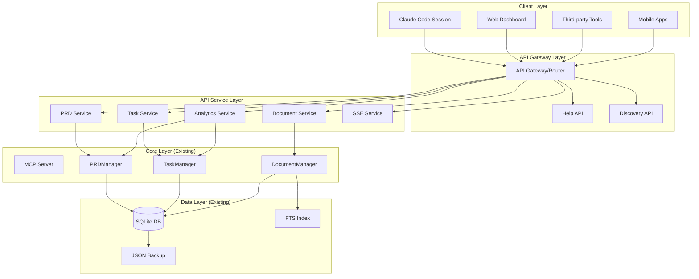

# 🏗️ 시스템 아키텍처 - WorkflowMCP Dashboard API

## 🎯 아키텍처 개요

**WorkflowMCP Dashboard API**는 기존 시스템을 확장하여 모든 MCP 도구와 대시보드 기능을 REST API로 제공하는 **자기 설명적(Self-Descriptive) API 시스템**입니다.

### 핵심 설계 원칙
1. **기존 시스템 무수정**: 기존 코드 수정 없이 추가 구현만
2. **자기 설명적**: API 자체에서 사용법과 구조를 제공
3. **세션 친화적**: 새로운 세션에서도 쉽게 API 탐색 가능
4. **단계적 발견**: Help → Discovery → Usage 흐름

## 🏛️ 전체 시스템 아키텍처



## 🔍 자기 설명적 API 설계

### 1. API Discovery 계층 구조

#### Level 0: Root API Discovery
```
GET /api
{
  "name": "WorkflowMCP Dashboard API",
  "version": "1.0",
  "description": "Complete API for WorkflowMCP system",
  "help": "/api/help",
  "discovery": "/api/discovery",
  "categories": {
    "prds": "/api/prds",
    "tasks": "/api/tasks", 
    "documents": "/api/documents",
    "analytics": "/api/analytics",
    "system": "/api/system"
  },
  "guides": {
    "getting_started": "/api/help/getting-started",
    "authentication": "/api/help/auth",
    "examples": "/api/help/examples"
  }
}
```

#### Level 1: Category Discovery
```
GET /api/prds
{
  "category": "PRD Management",
  "description": "Product Requirements Document management",
  "help": "/api/help/prds",
  "endpoints": {
    "list": "GET /api/prds",
    "create": "POST /api/prds", 
    "get": "GET /api/prds/{id}",
    "update": "PUT /api/prds/{id}",
    "delete": "DELETE /api/prds/{id}"
  },
  "schemas": "/api/schemas/prd",
  "examples": "/api/examples/prds"
}
```

### 2. Help API 시스템

#### 관리 메뉴별 Help API 구조
```
/api/help/
├── /getting-started          # 전체 API 사용법
├── /prds/                   # PRD 관리 도움말
│   ├── /overview            # PRD 기능 개요
│   ├── /crud-operations     # 기본 CRUD
│   ├── /linking             # 문서 연결
│   └── /examples            # 사용 예제
├── /tasks/                  # Task 관리 도움말  
│   ├── /overview
│   ├── /dependencies        # 의존성 관리
│   ├── /status-workflow     # 상태 변경
│   └── /examples
├── /documents/              # Document 관리 도움말
│   ├── /overview
│   ├── /search              # 검색 기능
│   ├── /types               # 문서 타입
│   └── /examples
├── /analytics/              # Analytics 도움말
│   ├── /overview
│   ├── /dashboards          # 대시보드 데이터
│   └── /examples
└── /system/                 # 시스템 관리 도움말
    ├── /health              # 헬스 체크
    ├── /batch               # 배치 작업
    └── /events              # 실시간 이벤트
```

### 3. 세션별 API 사용 패턴

#### 신규 세션 시작 시 권장 흐름
1. **API 탐색**: `GET /api` → 전체 구조 파악
2. **도움말 확인**: `GET /api/help/getting-started` → 사용법 학습
3. **카테고리 선택**: `GET /api/prds` → 특정 영역 탐색
4. **예제 확인**: `GET /api/help/prds/examples` → 실제 사용법
5. **스키마 확인**: `GET /api/schemas/prd` → 데이터 구조
6. **실제 사용**: `POST /api/prds` → API 호출

## 🔧 API 서비스 레이어 설계

### 1. API Router 구조

```javascript
// api-router.js (새로 생성)
const express = require('express');
const router = express.Router();

// Discovery & Help Routes
router.get('/', apiDiscoveryController.getRoot);
router.get('/help/*', helpController.getHelp);
router.get('/discovery/*', discoveryController.getDiscovery);
router.get('/schemas/*', schemaController.getSchema);
router.get('/examples/*', exampleController.getExample);

// Core API Routes
router.use('/prds', prdApiRouter);
router.use('/tasks', taskApiRouter);
router.use('/documents', documentApiRouter);
router.use('/analytics', analyticsApiRouter);
router.use('/system', systemApiRouter);

module.exports = router;
```

### 2. Service Layer 패턴

```javascript
// services/PrdApiService.js (새로 생성)
class PrdApiService {
  constructor(prdManager) {
    this.prdManager = prdManager; // 기존 PRDManager 재사용
  }
  
  async listPrds(filters = {}) {
    // 기존 MCP 도구 로직 재사용
    const result = await this.prdManager.listPRDs(
      filters.status, 
      filters.project_id, 
      filters.sort_by
    );
    
    // API 형식으로 변환
    return this.formatApiResponse(result);
  }
  
  formatApiResponse(mcpResult) {
    return {
      success: true,
      data: mcpResult.prds || mcpResult,
      message: mcpResult.message || 'Success',
      timestamp: new Date().toISOString(),
      links: this.generateHateoasLinks()
    };
  }
  
  generateHateoasLinks() {
    return {
      self: '/api/prds',
      help: '/api/help/prds',
      schema: '/api/schemas/prd',
      examples: '/api/help/prds/examples'
    };
  }
}
```

### 3. HATEOAS 링크 자동 생성

모든 API 응답에 관련 링크 포함:
```json
{
  "success": true,
  "data": { /* 실제 데이터 */ },
  "links": {
    "self": "/api/prds/123",
    "update": "PUT /api/prds/123", 
    "delete": "DELETE /api/prds/123",
    "documents": "/api/prds/123/documents",
    "help": "/api/help/prds",
    "examples": "/api/help/prds/examples"
  }
}
```

## 📊 기존 시스템 통합 전략

### 1. 기존 컴포넌트 재사용

```javascript
// 기존 시스템 래핑 패턴
class ApiServiceWrapper {
  constructor() {
    // 기존 매니저들 그대로 사용
    this.prdManager = new PRDManager();
    this.taskManager = new TaskManager(); 
    this.documentManager = new DocumentManager();
    
    // API 전용 기능 추가
    this.helpService = new HelpService();
    this.schemaService = new SchemaService();
    this.exampleService = new ExampleService();
  }
}
```

### 2. 데이터베이스 레이어 공유

```
기존 SQLite DB 스키마 유지
├── prds (기존)
├── tasks (기존)  
├── documents (기존)
├── document_links (기존)
└── api_schemas (신규) - API 스키마 정보
└── api_examples (신규) - API 예제 저장
```

### 3. 이벤트 시스템 통합

```javascript
// 기존 이벤트 시스템 확장
const EventEmitter = require('events');

class ApiEventManager extends EventEmitter {
  constructor() {
    super();
    
    // 기존 이벤트 연결
    this.on('prd:created', this.notifySSE);
    this.on('task:updated', this.notifySSE);
    this.on('document:created', this.notifySSE);
  }
  
  notifySSE(event) {
    // SSE 클라이언트들에게 실시간 알림
    this.sseService.broadcast(event);
  }
}
```

## 🔄 Help API 상세 설계

### 1. 동적 Help 생성

```javascript
// services/HelpService.js (새로 생성)
class HelpService {
  constructor() {
    this.helpContent = {
      'getting-started': this.getGettingStartedGuide(),
      'prds/overview': this.getPrdOverview(),
      'prds/examples': this.getPrdExamples(),
      'tasks/dependencies': this.getTaskDependencyGuide()
    };
  }
  
  getGettingStartedGuide() {
    return {
      title: "WorkflowMCP API 시작하기",
      sections: [
        {
          title: "1. API 탐색",
          content: "GET /api 를 호출하여 전체 API 구조를 파악하세요",
          example: "curl http://localhost:3301/api"
        },
        {
          title: "2. 카테고리 선택", 
          content: "원하는 기능의 카테고리를 선택하세요 (prds, tasks, documents 등)",
          example: "curl http://localhost:3301/api/prds"
        }
      ],
      next_steps: [
        "/api/help/prds/overview",
        "/api/help/tasks/overview", 
        "/api/help/documents/overview"
      ]
    };
  }
}
```

### 2. 관리 메뉴별 Help API

#### PRD 관리 Help
```
GET /api/help/prds/overview
{
  "title": "PRD 관리 API 개요",
  "description": "Product Requirements Document 관리를 위한 완전한 API",
  "quick_start": {
    "create_prd": "POST /api/prds",
    "list_prds": "GET /api/prds", 
    "get_prd": "GET /api/prds/{id}"
  },
  "common_workflows": [
    {
      "name": "새 PRD 생성 및 문서 연결",
      "steps": [
        "POST /api/prds - PRD 생성",
        "POST /api/documents - 관련 문서 생성", 
        "POST /api/prds/{id}/documents - 문서 연결"
      ]
    }
  ],
  "troubleshooting": {
    "400_errors": "필수 필드 확인: title, description",
    "404_errors": "PRD ID 존재 여부 확인",
    "409_errors": "중복 제목 방지"
  }
}
```

### 3. 실시간 Help 업데이트

```javascript
// API 사용 패턴 분석하여 맞춤형 도움말 제공
class SmartHelpService {
  trackApiUsage(endpoint, success, error) {
    // 사용 패턴 기록
    this.usageStats[endpoint] = {
      calls: (this.usageStats[endpoint]?.calls || 0) + 1,
      errors: success ? 0 : (this.usageStats[endpoint]?.errors || 0) + 1,
      lastError: error
    };
  }
  
  getPersonalizedHelp(sessionId) {
    // 세션별 사용 이력 기반 맞춤 도움말
    const usage = this.sessionUsage[sessionId];
    return {
      suggestions: this.generateSuggestions(usage),
      common_errors: this.getCommonErrors(usage),
      next_recommended: this.getRecommendedApis(usage)
    };
  }
}
```

## 🚀 확장 가능한 아키텍처

### 1. 플러그인 아키텍처

```javascript
// Plugin System for API Extensions
class ApiPluginManager {
  constructor() {
    this.plugins = new Map();
  }
  
  registerPlugin(name, plugin) {
    // 새로운 API 카테고리 동적 추가
    this.plugins.set(name, plugin);
    this.updateApiDiscovery();
  }
  
  updateApiDiscovery() {
    // /api 응답에 새 플러그인 카테고리 추가
    this.discoveryService.addCategory(plugin);
  }
}
```

### 2. 자동 스키마 생성

```javascript
// 기존 MCP 도구 분석하여 자동 스키마 생성
class SchemaGenerator {
  generateFromMcpTool(toolName) {
    const tool = this.mcpTools[toolName];
    return {
      input_schema: this.extractInputSchema(tool),
      output_schema: this.extractOutputSchema(tool),
      examples: this.generateExamples(tool)
    };
  }
}
```

### 3. 버전 관리 시스템

```javascript
// API 버전 관리
const versionedRouter = {
  'v1': require('./routes/v1'),
  'v2': require('./routes/v2') // 향후 확장
};

app.use('/api/:version', (req, res, next) => {
  const version = req.params.version;
  if (versionedRouter[version]) {
    versionedRouter[version](req, res, next);
  } else {
    res.status(404).json({
      error: 'API version not found',
      available_versions: Object.keys(versionedRouter),
      help: '/api/help/versioning'
    });
  }
});
```

## 📡 실시간 통신 아키텍처

### 1. Server-Sent Events (SSE)

```javascript
// SSE 서비스 구조
class SSEService {
  constructor() {
    this.connections = new Map(); // sessionId -> response object
    this.eventFilters = new Map(); // sessionId -> filter config
  }
  
  subscribe(req, res) {
    const sessionId = req.headers['x-session-id'] || this.generateSessionId();
    
    res.writeHead(200, {
      'Content-Type': 'text/event-stream',
      'Cache-Control': 'no-cache',
      'Connection': 'keep-alive',
      'Access-Control-Allow-Origin': '*'
    });
    
    this.connections.set(sessionId, res);
    
    // 연결 확인 메시지
    this.sendEvent(sessionId, {
      type: 'connected',
      data: { message: 'SSE connection established' }
    });
  }
  
  broadcast(event) {
    this.connections.forEach((res, sessionId) => {
      if (this.shouldSendEvent(sessionId, event)) {
        this.sendEvent(sessionId, event);
      }
    });
  }
}
```

### 2. WebSocket 지원 (향후 확장)

```javascript
// WebSocket 지원 준비
class WebSocketService {
  constructor() {
    this.wss = null; // 향후 WebSocket 서버
  }
  
  upgrade(server) {
    // HTTP → WebSocket 업그레이드 지원
    this.wss = new WebSocketServer({ server });
  }
}
```

## 🔒 보안 아키텍처

### 1. 입력 검증 미들웨어

```javascript
// 모든 API 입력 검증
const validationMiddleware = {
  validatePrdInput: (req, res, next) => {
    const schema = joi.object({
      title: joi.string().min(1).max(200).required(),
      description: joi.string().min(1).required(),
      requirements: joi.array().items(joi.string()),
      priority: joi.string().valid('high', 'medium', 'low')
    });
    
    const { error } = schema.validate(req.body);
    if (error) {
      return res.status(400).json({
        success: false,
        error: {
          code: 'VALIDATION_ERROR',
          message: 'Invalid input data',
          details: error.details.map(d => d.message)
        }
      });
    }
    next();
  }
};
```

### 2. Rate Limiting

```javascript
// API별 Rate Limiting
const rateLimiter = rateLimit({
  windowMs: 15 * 60 * 1000, // 15분
  max: 1000, // 최대 1000 요청
  message: {
    success: false,
    error: {
      code: 'RATE_LIMIT_EXCEEDED',
      message: 'Too many requests',
      help: '/api/help/rate-limits'
    }
  }
});
```

## 📈 성능 최적화 아키텍처

### 1. 캐싱 레이어

```javascript
// 다층 캐싱 시스템
class CacheManager {
  constructor() {
    this.memoryCache = new Map(); // 메모리 캐시
    this.queryCache = new Map();  // 쿼리 결과 캐시
  }
  
  async get(key, fetcher) {
    // 1. 메모리 캐시 확인
    if (this.memoryCache.has(key)) {
      return this.memoryCache.get(key);
    }
    
    // 2. 데이터 페치 및 캐시 저장
    const data = await fetcher();
    this.memoryCache.set(key, data);
    
    return data;
  }
  
  invalidate(pattern) {
    // 패턴 기반 캐시 무효화
    for (const key of this.memoryCache.keys()) {
      if (key.includes(pattern)) {
        this.memoryCache.delete(key);
      }
    }
  }
}
```

### 2. 쿼리 최적화

```javascript
// 기존 매니저 쿼리 최적화 래퍼
class OptimizedQueryWrapper {
  constructor(manager) {
    this.manager = manager;
    this.queryCache = new Map();
  }
  
  async optimizedList(filters) {
    const cacheKey = JSON.stringify(filters);
    
    if (this.queryCache.has(cacheKey)) {
      return this.queryCache.get(cacheKey);
    }
    
    const result = await this.manager.list(filters);
    this.queryCache.set(cacheKey, result);
    
    // 5분 후 캐시 만료
    setTimeout(() => {
      this.queryCache.delete(cacheKey);
    }, 5 * 60 * 1000);
    
    return result;
  }
}
```

## 🔧 개발자 도구 아키텍처

### 1. API 테스트 콘솔

```javascript
// 내장 API 테스트 도구
app.get('/api/console', (req, res) => {
  res.send(`
    <!DOCTYPE html>
    <html>
    <head>
      <title>WorkflowMCP API Console</title>
      <style>/* API 테스트 UI 스타일 */</style>
    </head>
    <body>
      <div id="api-console">
        <!-- 대화형 API 테스트 인터페이스 -->
      </div>
      <script>
        // API 호출 및 응답 표시 로직
      </script>
    </body>
    </html>
  `);
});
```

### 2. 자동 문서 생성

```javascript
// OpenAPI/Swagger 자동 생성
class ApiDocGenerator {
  generateOpenApiSpec() {
    return {
      openapi: '3.0.0',
      info: {
        title: 'WorkflowMCP Dashboard API',
        version: '1.0.0',
        description: 'Complete API for WorkflowMCP system'
      },
      paths: this.generatePaths(),
      components: {
        schemas: this.generateSchemas()
      }
    };
  }
}
```

---

**작성일**: 2025-09-11  
**작성자**: 시스템 설계자 (Claude Code)  
**검토자**: 요구사항 분석가, 개발자  
**버전**: 1.0  
**상태**: 데이터베이스 설계 대기